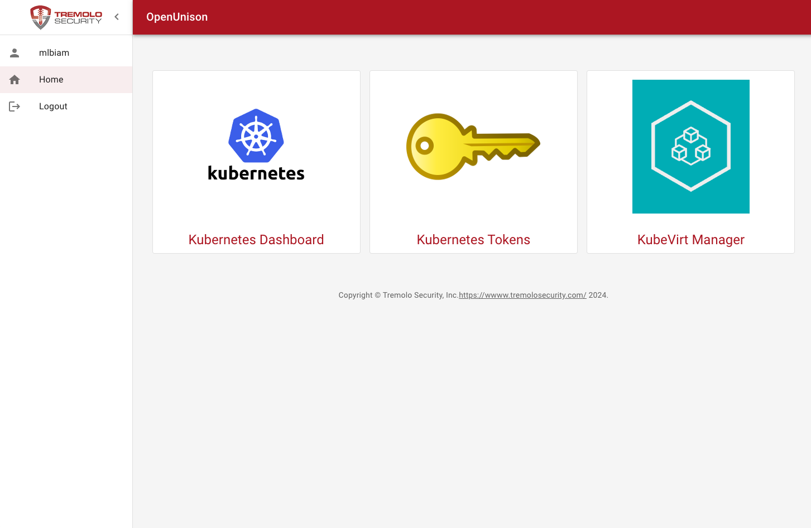

# KubeVirt Manager

KubeVirt Manager is a UI for accessing your VMs.

## Deployment

```
pulumi config set kubevirt_manager.enabled true
```

Then

```
pulumi up
```

## Access

### Without OpenUnison

Use port-forward

```
kubectl port-forward svc/kubevirt-manager -n kubevirt-manager 8080:8080
```

### With OpenUnison

OpenUnison will deploy with KubeVirt Manager if both are enabled. There will be a badge on the front page:


