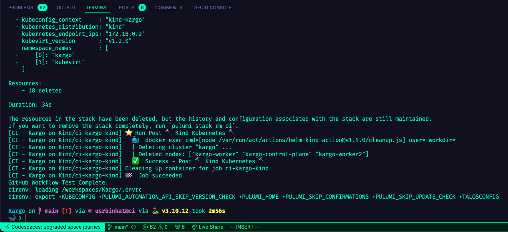

# Kargo - The Cloud-Native ESXi Replacement

[](https://github.com/ContainerCraft/Kargo/actions/workflows/kind.yaml)

Join the conversation on the [ContainerCraft Community Discord Kargo Channel](https://discord.gg/Jb5jgDCksX).

> Kargo Project opened in the [Konductor Devcontainer](https://github.com/ContainerCraft/Konductor) with Github Codespaces.
> 
> NOTE: This project is in pre-alpha pathfinding mode. See the [inaugural Twitter/X Thread post](https://x.com/usrbinkat/status/1749186949590794551) by [@usrbinkat](https://twitter.com/usrbinkat)

## About

Kargo is a community project to build the first Platform Engineered virtualization environment to replace the need for hypervisors that may no longer be suitable for cloud-native environments. The project is a collaboration between the ContainerCraft community, Kubernetes industry leaders, virtualization experts, and practitioners to build a common sharable platform for virtualized environments in both on-prem, cloud, and local environments.

For more information, see the [Kargo Project FAQ](FAQ.md).

### Goals

- Eliminate the barrier to entry for learning Kubernetes and Cloud Native technologies
- Provide a common platform for the community to collaborate and share knowledge
- Enable anyone to experience the power of owning a local cloud platform
- Accelerate the time-to-achievement for new projects and ideas
- Develop a community library of sharable middleware and application IaC for use on Kargo
- Select enterprise grade technologies and practices to build a valuable learning platform
- Be the best hypervisor and container platform for the Homelab community

### Non-Goals

- Kargo is not a production platform
- Kargo will not try to be everything for everyone

## Getting Started

The following steps guide users through the basic steps of getting started with Kargo in [GitHub Codespaces] or locally on a linux machine with Docker, VSCode, and Dev Containers.

While MacOS is supported, virtual machines will not start due to the lack of nested virtualization support.

## Prerequisites

Accounts:

1. [GitHub](https://github.com)
2. [Pulumi Cloud](https://app.pulumi.com/signup)

Tools (Either/Or):

- [VSCode](https://code.visualstudio.com/download) with the [VSCode GitHub Codespaces](https://marketplace.visualstudio.com/items?itemName=GitHub.codespaces) extension.
- [Chrome](https://www.google.com/chrome) or [Edge](https://www.microsoft.com/en-us/edge) Browser to launch [GitHub Codespaces].

#### BEFORE YOU BEGIN:

Select from the following ways to run the quickstart:

- Using a Web Browser
- Using VSCode with GitHub Codespaces
- Using VSCode with Docker + Dev Containers on Local Linux Machine
- Using VSCode with Docker + Dev Containers on Local MacOS Machine

<details><summary>CLICK TO EXPAND</summary>

### For using a Web Browser

<details><summary>click to expand steps</summary>

Tested in Google Chrome & Microsoft Edge browsers.

1. Open the [Kargo GitHub repository](https://github.com/ContainerCraft/Kargo) in your browser.
2. Click the `Code` button and select `Codespaces` tab.
3. Click the Codespaces > Codespaces > 3-dot menu > `New with options`.
4. select the following:

| Option                        | Value                          |
| ----------------------------- | ------------------------------ |
| `Branch`                      | `main`                         |
| `Dev container configuration` | `konductor`                    |
| `Region`                      | `$USERS_CHOICE`                |
| `Machine type`                | `4 cores, 16 GB RAM` or better |

5. Click the `Create` button.

Wait for Codespace build.

Then continue with the [How To](#how-to) instructions.

</details>

### For VSCode with GitHub Codespaces

<details><summary>click to expand steps</summary>

Run the following steps in the [VSCode command palette](https://code.visualstudio.com/docs/getstarted/userinterface#_command-palette) by pressing '`Ctrl + Shift + P`'

1. `Codespaces: Create New Codespace`
2. `Select a repository` use fuzzy search to find `ContainerCraft/Kargo`
3. `Select the branch main`
4. `Select an instance size of at least 4 cores & 16GB of RAM`

Wait for Codespace build.

Then continue with the [How To](#how-to) instructions.

</details>

### For VSCode with Docker + Dev Containers on Local Linux Machine

<details><summary>click to expand steps</summary>

Ensure you have the following installed:

- [Docker](https://docs.docker.com/get-docker/)
- [VSCode](https://code.visualstudio.com/download)
- [VSCode Remote - Containers](https://marketplace.visualstudio.com/items?itemName=ms-vscode-remote.remote-containers)

1. Open the Kargo repository in VSCode.
2. Click the green `><` icon in the bottom left corner of the VSCode window.
3. Select `Remote-Containers: Reopen in Container`.
4. Select the `konductor` dev container configuration.

Wait for the dev container to build.

Then continue with the [How To](#how-to) instructions.

</details>

### For VSCode with Docker + Dev Containers on Local MacOS Machine
* NOTE: This configuration works for development, but virtual machines will not start. *

<details><summary>click to expand steps</summary>

Ensure you have the following installed:

- [Docker](https://docs.docker.com/get-docker/)
- [VSCode](https://code.visualstudio.com/download)
- [VSCode Remote - Containers](https://marketplace.visualstudio.com/items?itemName=ms-vscode-remote.remote-containers)

1. Open the Kargo repository in VSCode.
2. Click the green `><` icon in the bottom left corner of the VSCode window.
3. Select `Remote-Containers: Reopen in Container`.
4. Select the `konductor` dev container configuration.

Wait for the dev container to build.

Then continue with the [How To](#how-to) instructions.

</details>

</details>

## How To

1. Open the VSCode [integrated terminal](https://code.visualstudio.com/docs/editor/integrated-terminal) by pressing '`` Ctrl + ` ``'.
2. Login to Pulumi Cloud by running `pulumi login` in the terminal.

```bash
# Login to Pulumi Cloud
pulumi login
```

# Start a Talos-in-Docker Kubernetes cluster

3. Execute the following commands in the terminal

```bash
# 1. Start a Talos-in-Docker Kubernetes cluster
# 2. Deploy the Kargo Kubevirt PaaS Pulumi IaC
task deploy
```

4. Deploy a Kubevirt VM instance

```bash
# Enable the VM instance
pulumi config set --path vm.enabled true

# Deploy the Kubevirt VM instance
pulumi up
```

5. Access the VM instance

```bash
# Access the VM instance via ssh with virtctl
# uname:passwd = kc2:kc2
virtctl ssh kc2@ubuntu-ephemeral-nat

# Access the VM instance via ssh
ssh -p 30590 -i ~/.ssh/id_rsa kc2@localhost

# Access the VM instance via serial console
virtctl console ubuntu-ephemeral-nat
```

[GitHub Codespaces]: https://github.com/features/codespaces

## Contributing

Kargo is a community project and we welcome contributions from everyone. Please see [CONTRIBUTING.md](https://github.com/ContainerCraft/Kargo/issues/22) for more information on how to get involved.

To get started, join the conversation on the [ContainerCraft Community Discord Kargo Channel](https://discord.gg/Jb5jgDCksX).

### Developing Kargo

Manually testing with the kargo on kind workflow is a great way to get started with Kargo development.

Additionally, Konductor and the Kargo repository are built with support for [act](https://nektosact.com/), a tool for running Github Action Runner pipelines locally. This is a great way to test your code changes for CI before committing to git.

The following commands are useful for testing Kargo CI locally:

```bash
make act
```

Running CI in GitHub Codespaces currently takes approximately 3 minutes when using the `act` tool. A successful run will conclude something like this:


