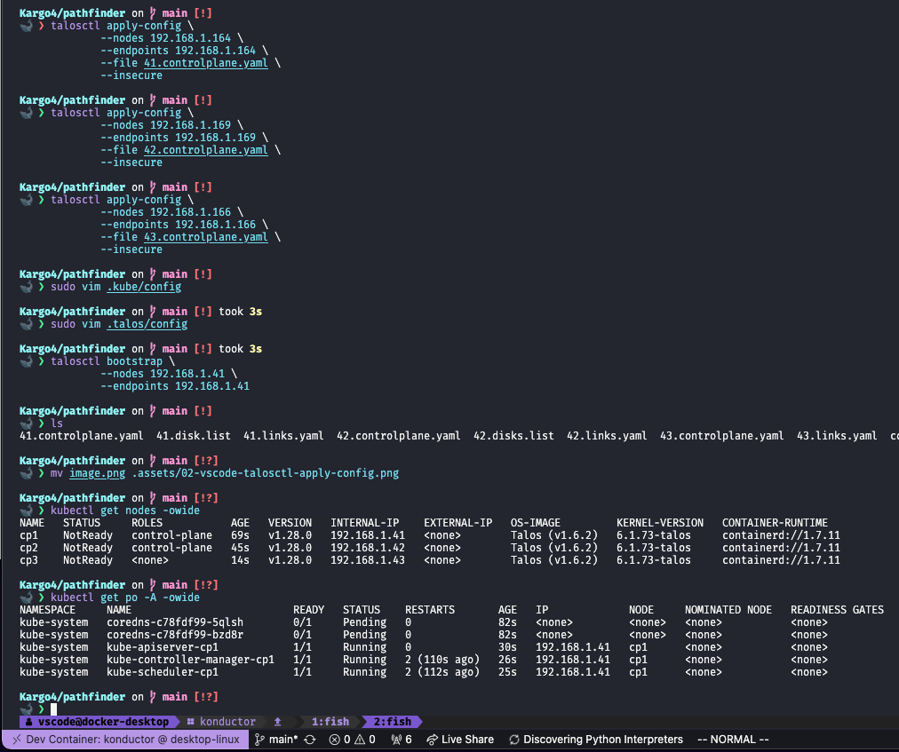

# Kargo Community Homelab Platform Engineering

> Kargo Project opened in the [Konductor Devcontainer](https://github.com/ContainerCraft/Konductor) with Github Codespaces.
> 

This project is in pre-alpha pathfinding mode. See the [inaugural Twitter/X Thread post](https://x.com/usrbinkat/status/1749186949590794551) by [@usrbinkat](https://twitter.com/usrbinkat)

Join the conversation on the [ContainerCraft Community Discord Kargo Channel](https://discord.gg/BAMwwqys).

