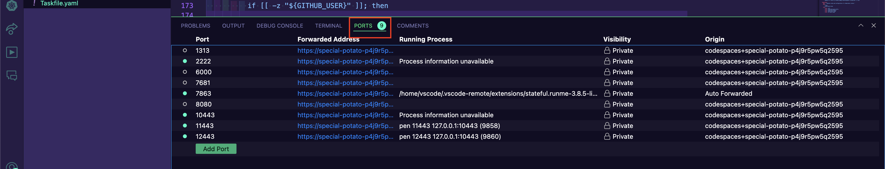
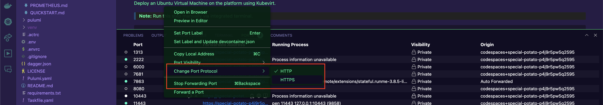

# OpenUnison for Cluster Access

# Dependencies

1. Ingress NGINX

OpenUnison requires the NGINX Ingress controller for MVP.  While several controllers are supported, we wanted to keep it simple for now.  If you're running Kargo in GitHub CodeSpaces, NGINX will be configured to support port forwarding so you can access OpenUnison, and your cluster, from anywhere on the internet.  If running Kargo on bare metal, You'll need to configure Cilium's `LoadBalancer` to support NGINX.

2. DNS suffix (Bare Metal Only)

OpenUnison requires a minimum of three host names. More if deploying additional platform management apps. For this reason, you'll need to create a DNS wildcard for a domain suffix to point to your load balancer. For instance, in the below examples a wildcard of \*.kargo.tremolo.dev was setup with an A record for my lab hosts. For a full explination, see - https://openunison.github.io/deployauth/#host-names-and-networking

3. GitHub Deployment

Before deploying OpenUnison, you'll need to create an organization on GitHub. This is 100% free. Once you have created an organization, you can setup an OAuth App. See https://openunison.github.io/deployauth/#github for instructions.

For deployments to GitHub CodeSpaces, enter a fake URL for the redirect for now.  When you setup SSO in the code space, you'll be given a URL to use.

For bare metal, your redirect URL will be `https://k8sou.DNS Suffix/auth/github`. You should also create a Team that you'll use authorizing access to your lab. Keep your `client_id` and `client_secret`.


# Setup

## GitHub CodeSpace

Once you've run `task deploy`, the next step is to run:

```bash
task configure-openunison
```
You'll be asked for:

1. GitHub OAuth2 Application Client ID
2. GitHub OAuth2 Application Client Secret
3. The name of a GitHub team in the form of org/team.  For Instance, `TremoloSecurity/github-demos`

When the configuration is done, you'll be presented with a redirect URL.  Configure your OAuth2 application with this URL as the redirect.

Next, run the deployment again:

```sh
task deploy
```

With the deployment completed, you need to configure three ports to enable HTTPS and public access:

* 10443
* 11443
* 12443

For each port, navigate to the ***PORTS*** tab in you VSCode window:



Right click on the port, choose ***Change Port Protocol*** and choose ***HTTPS***



Finally, mark the port as public by again right clicking on the port, choose ***Port Visibility*** and select ***Public***.

Repeat this step for all three of the ports 10443,11442, and 12443.

## Bare Metal

Enable Cert-Manager

OpenUnison requires TLS. Instead of the self-signed certs that OpenUnison uses by default, use the integrated Cert-Manager that comes with HomeLab. If you don't have an existing `ClusterIssuer` you want to use, you can use HomeLab's.

```
pulumi config set cert_manager.enabled true
```

Set a `ClusterIssuer`

```
pulumi config set openunison.cluster_issuer cluster-selfsigned-issuer-ca
```

Set a domain suffix

```
pulumi config set openunison.dns_suffix kargo.tremolo.dev
```

Set the client_id

```
pulumi config set openunison.github.client_id
```

Set the client secret

```
pulumi config set openunison.github.client_secret 'XXXXXXXXXXXXXXXXXXXXXXXXXXX' --secret
```

set the list of allowed teams in the form `org/team` or `org/` for the entire GitHub org you created.

```
pulumi config set openunison.github.teams 'TremoloSecurity/'
```

# Inviting Friends

If you want to allow more users to access your cluster, add them to the team you created in your GitHub org.

# Using OpenUnison

## GitHub CodeSpace

To access your cluster running a CodeSpace, get hte URL for the 10443 port.  If everything is configured correctly, you'll be prompted to continue by GitHub and then to trust your GitHub Application.  After that, you'll be logged in to OpenUnison with access to your cluster.

### Limitations

When running in CodeSpaces, any action that requires SPDY will not work, this includes:

* kubectl exec
* kubectl cp
* kubectl port-forward

You can use the terminal for any `Pod` in the Kubernetes Dashboard though.

## Bare Metal

See our manual - https://openunison.github.io/documentation/login-portal/
