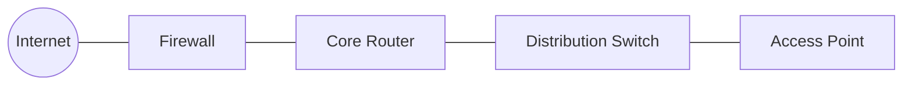
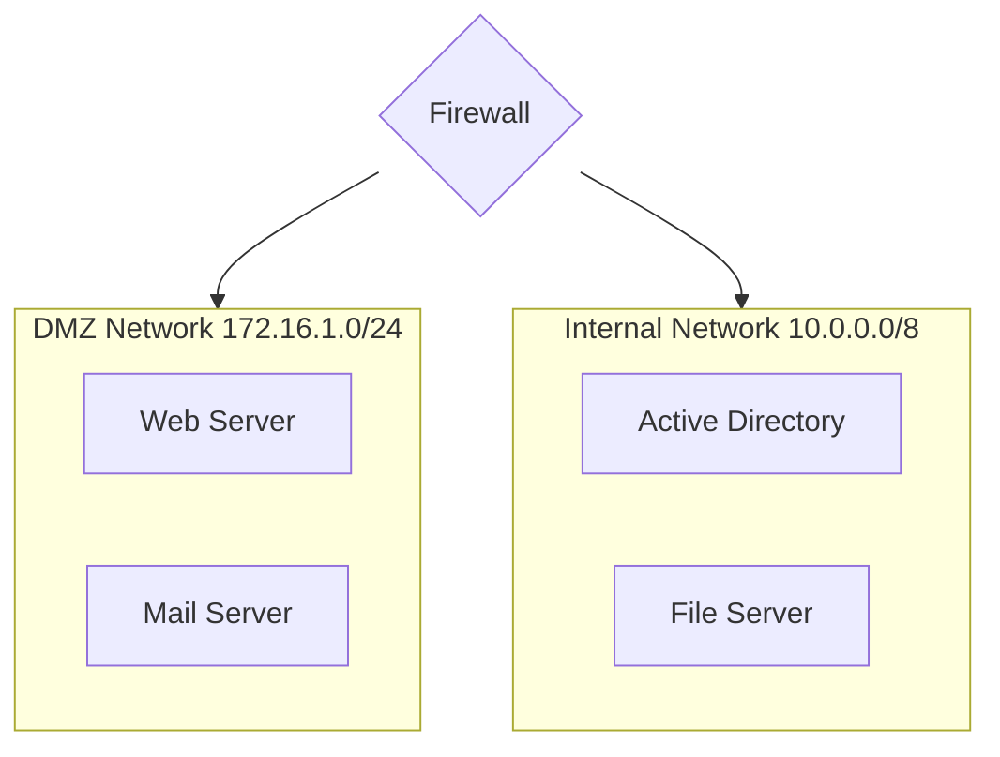
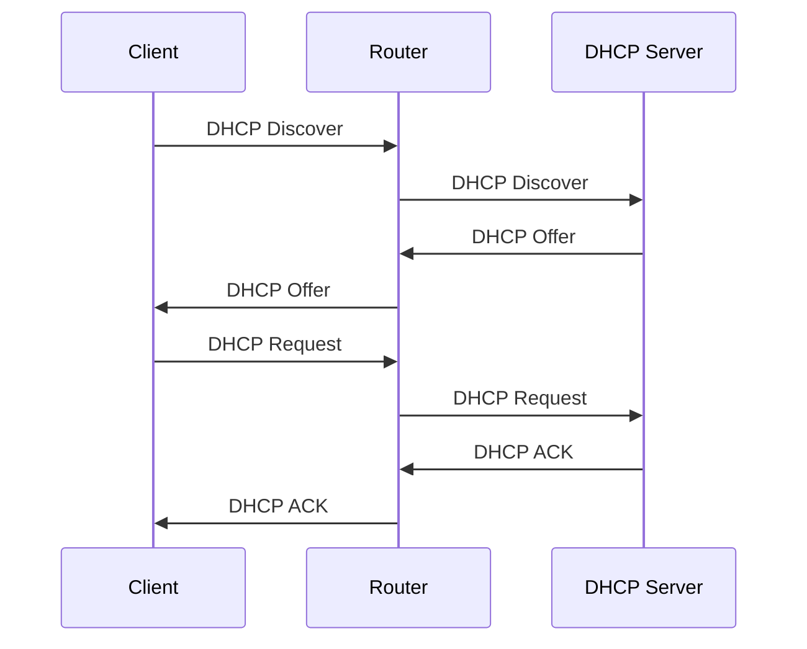
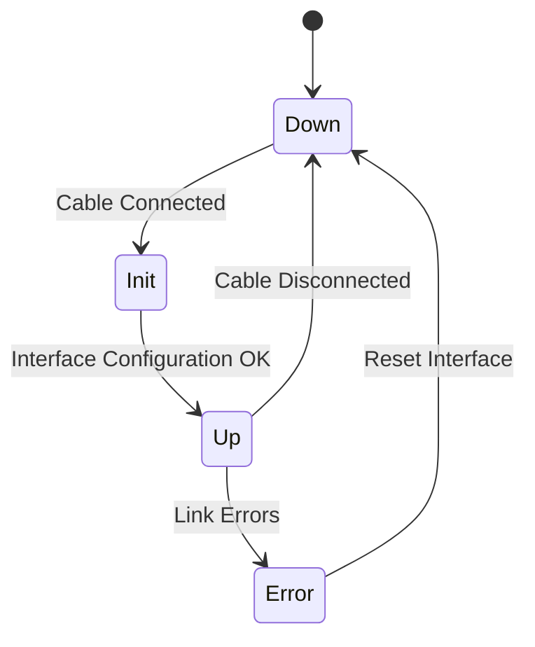
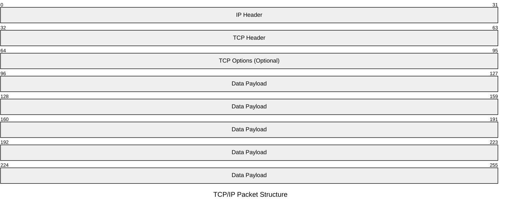
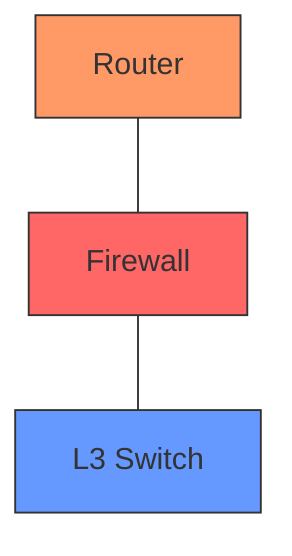
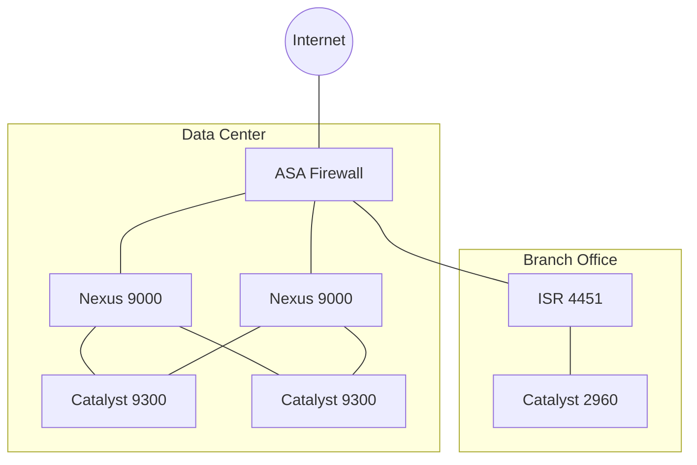
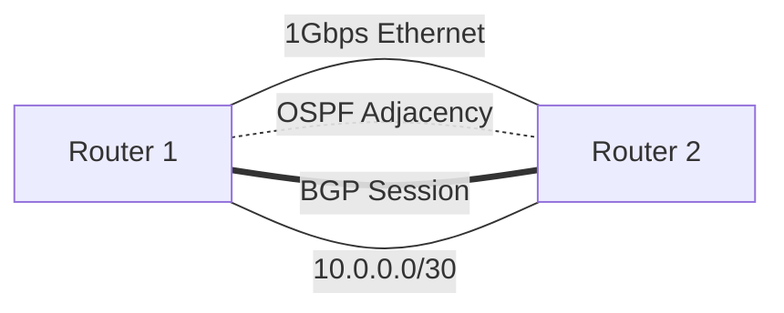
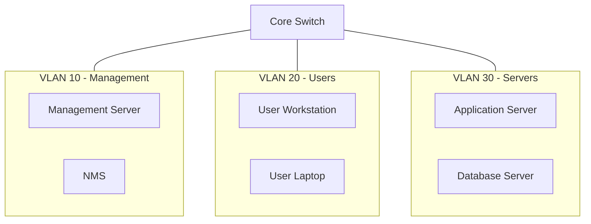

# Network Engineering Documentation with Mermaid - Part 1: Getting Started with Network Diagrams

## Introduction

Mermaid enables network engineers to create and maintain network documentation directly in code, making it version-control friendly and easily maintainable. Network diagrams stay synchronized with infrastructure changes through simple text updates rather than complex visual editor manipulations.

### Installation

```bash
# NPM installation
npm install -g @mermaid-js/mermaid-cli

# Include in HTML
<script src="https://cdn.jsdelivr.net/npm/mermaid@11.4.0/dist/mermaid.min.js"></script>
```

Initialize Mermaid in your documentation:

```javascript
mermaid.initialize({
  startOnLoad: true,
  theme: 'default',
  flowchart: {
    useMaxWidth: false,
    htmlLabels: true
  }
});
```

## Core Network Diagram Types

### 1. Network Topology Flowcharts

Basic network topology using flowchart syntax:



Adding subnets and VLANs:



### 2. Protocol Interactions

Using sequence diagrams for network protocols:



### 3. Device State Diagrams

Network interface states using state diagrams:



### 4. Packet Analysis

TCP/IP packet structure:



## Basic Network Components

### Network Device Representation

Standard network device symbols:



### Complex Enterprise Example



### Network Links and Connections

Different connection types:



### VLAN Configuration



## Best Practices

1. Use consistent naming conventions
   - Devices: R1, SW1, FW1
   - Networks: NET1, VLAN10, DMZ
   - Interfaces: Gi0/1, Te1/1

2. Include relevant network information
   - IP addresses and subnets
   - Interface designations
   - Protocol information
   - VLAN assignments

3. Maintain diagram hierarchy
   - Top-level overview
   - Detailed subnet views
   - Protocol-specific diagrams

4. Use appropriate diagram types
   - Flowcharts for topology
   - Sequence diagrams for protocols
   - State diagrams for status
   - Packet diagrams for data flow
