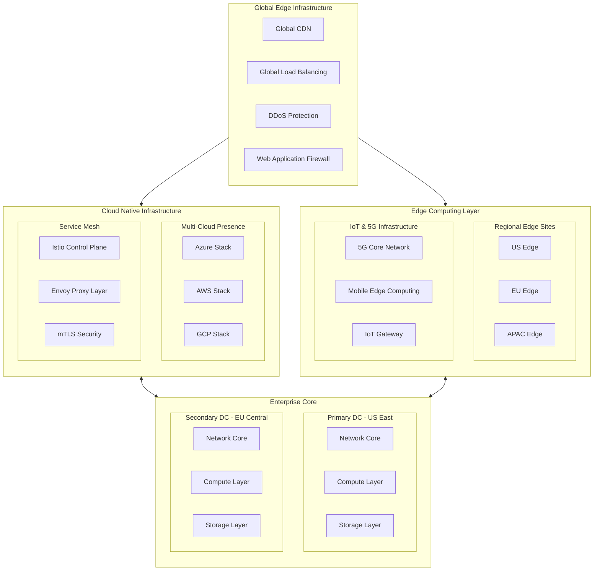
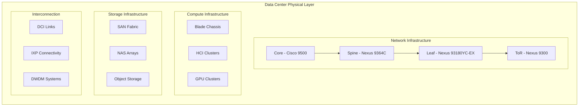
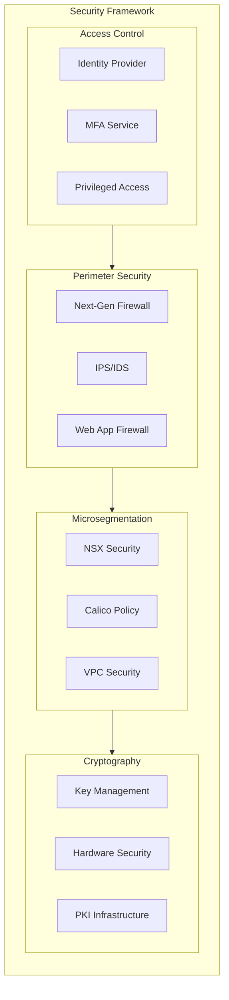
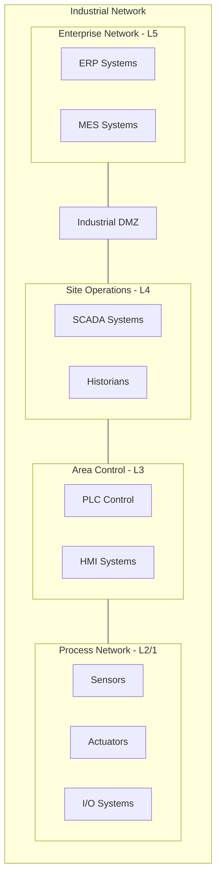
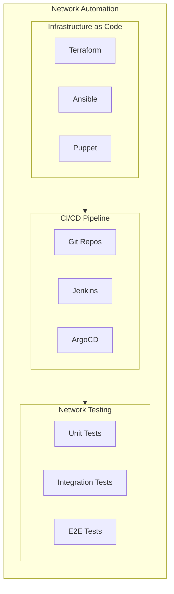
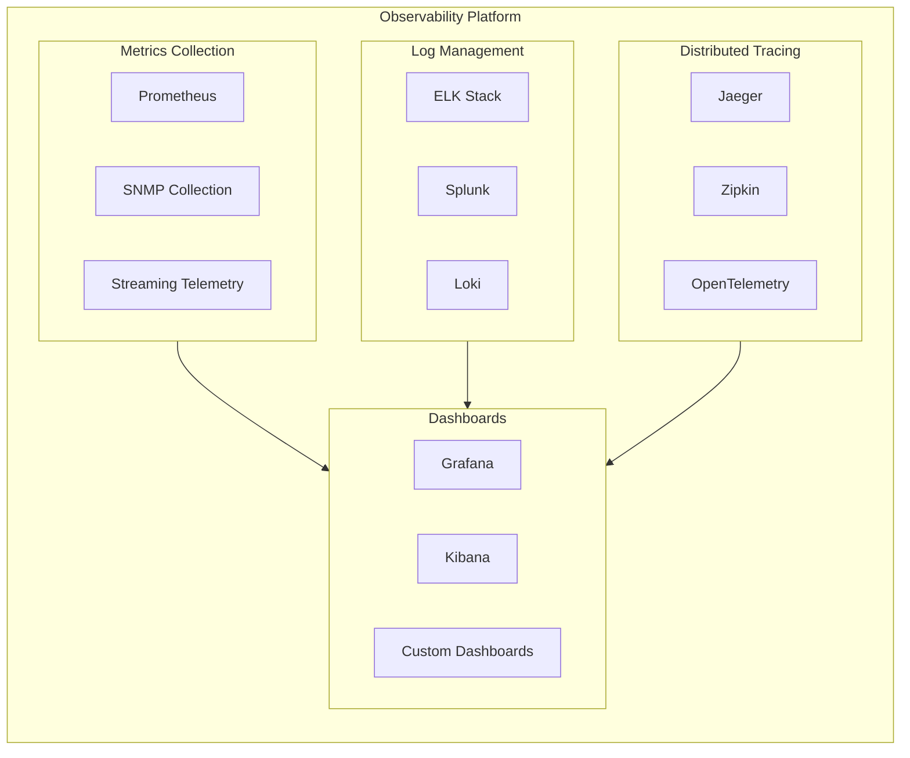
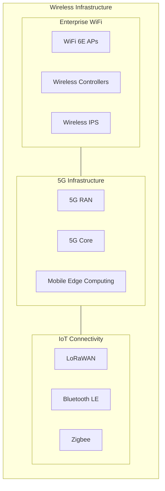
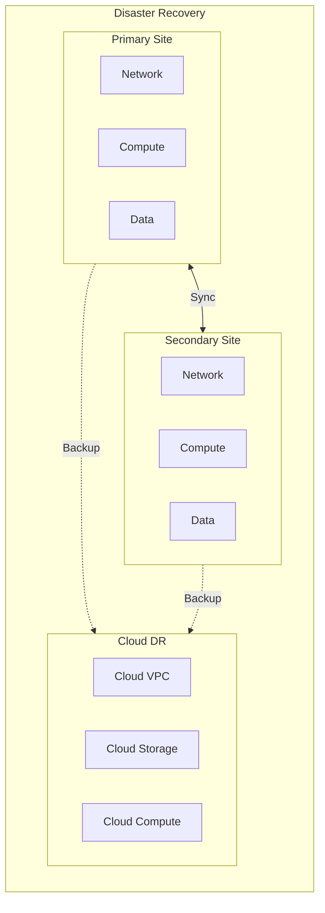

# Enterprise Network Architecture Reference Design

This reference architecture demonstrates an enterprise-grade global network infrastructure implementing zero-trust security, cloud-native principles, and automated operations. It serves as both a practical implementation guide and an educational resource for network engineers across all expertise levels.

## Architecture Overview

### Global Infrastructure Layout

### Physical Infrastructure Components

## Network Segmentation & Security

### Zero Trust Security Architecture

## Manufacturing & OT Networks

### Industrial Network Architecture

## Network Operations & Automation

### DevOps Workflow

## Observability & Monitoring

### Monitoring Stack

## Wireless & Mobile Infrastructure

### 5G and WiFi Integration

## Disaster Recovery & Business Continuity

### Recovery Architecture

## Implementation Guidelines

### Prerequisites
- Network engineering expertise (CCNA/CCNP/CCIE)
- Cloud platform experience
- Security certification (CISSP/CCSP)
- Automation skills (Python/Ansible)
- Infrastructure as Code experience

### Documentation
- [Network Architecture Guide](docs/architecture.md)
- [Security Implementation](docs/security.md)
- [Automation Framework](docs/automation.md)
- [Operations Playbook](docs/operations.md)

## Compliance Framework

### Standards Implementation
- SOC 2 Type II Controls
- ISO 27001 Framework
- HIPAA Security Rule
- PCI DSS Requirements
- NIST Cybersecurity Framework
- GDPR Data Protection

### Automated Compliance
- Continuous compliance monitoring
- Automated control validation
- Real-time compliance reporting
- Policy enforcement automation
- Audit trail logging

## Support & Operations

### Resources
- [Network Operations Center](https://noc.enterprise.com)
- [Security Operations Center](https://soc.enterprise.com)
- [Engineering Wiki](https://wiki.enterprise.com)
- [API Documentation](https://api.enterprise.com)

### Teams
- Network Engineering
- Security Operations
- Cloud Platform
- Automation & DevOps
- Compliance & Governance

## License

This architecture is licensed under the Apache License 2.0 - see the [LICENSE](LICENSE) file for details.

---

*Maintained by Enterprise Network Architecture Team*
