# Network Engineering Documentation with Mermaid - Part 2: Advanced Network Diagramming

## Enterprise Network Diagrams

### Campus Network Layout

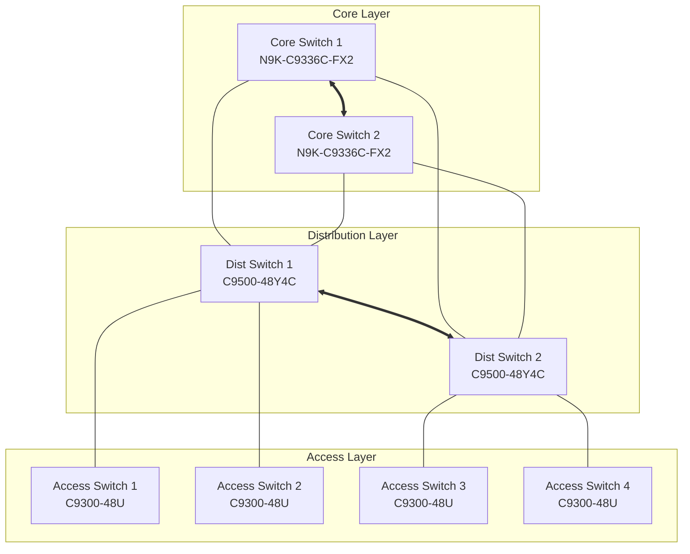

### Data Center Topology

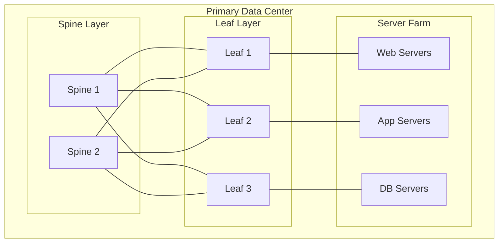

### SD-WAN Architecture

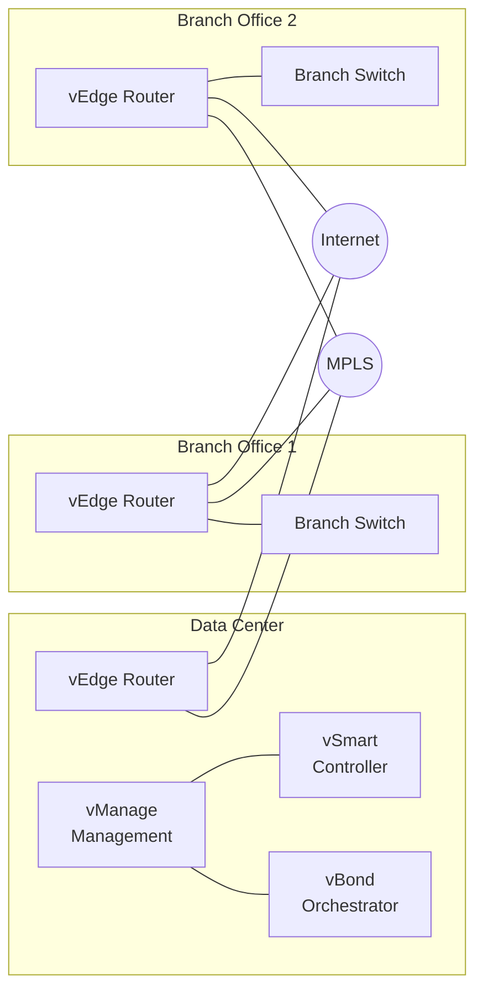

## Protocol and Service Flows

### BGP Route Advertisement

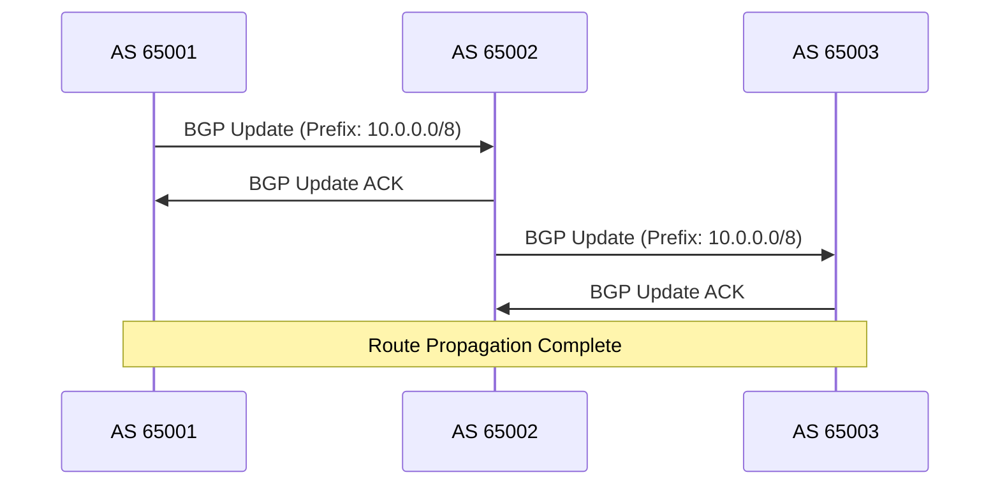

### High Availability Failover

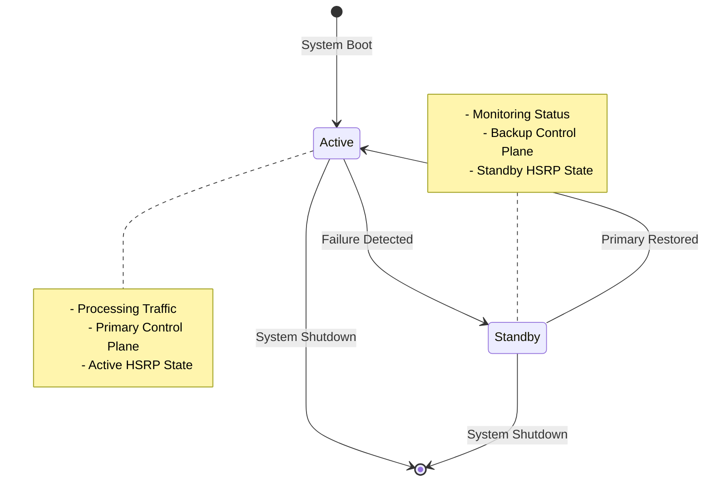

### Load Balancer Configuration

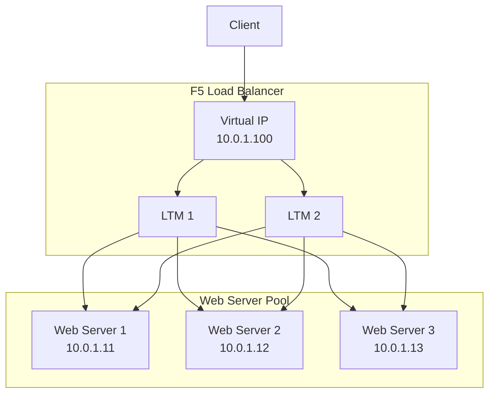

## Network Security Implementation

### Security Zones and Policy

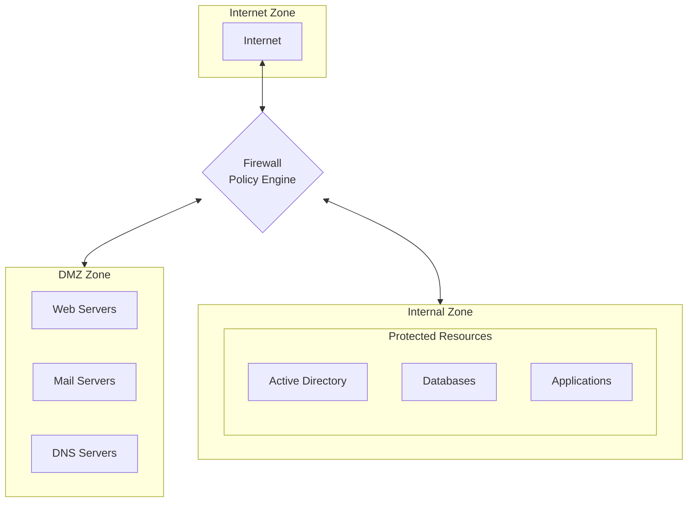

### VPN Tunnel Configuration

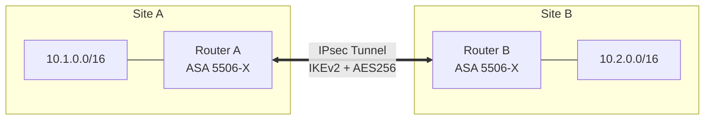

### Zero Trust Architecture

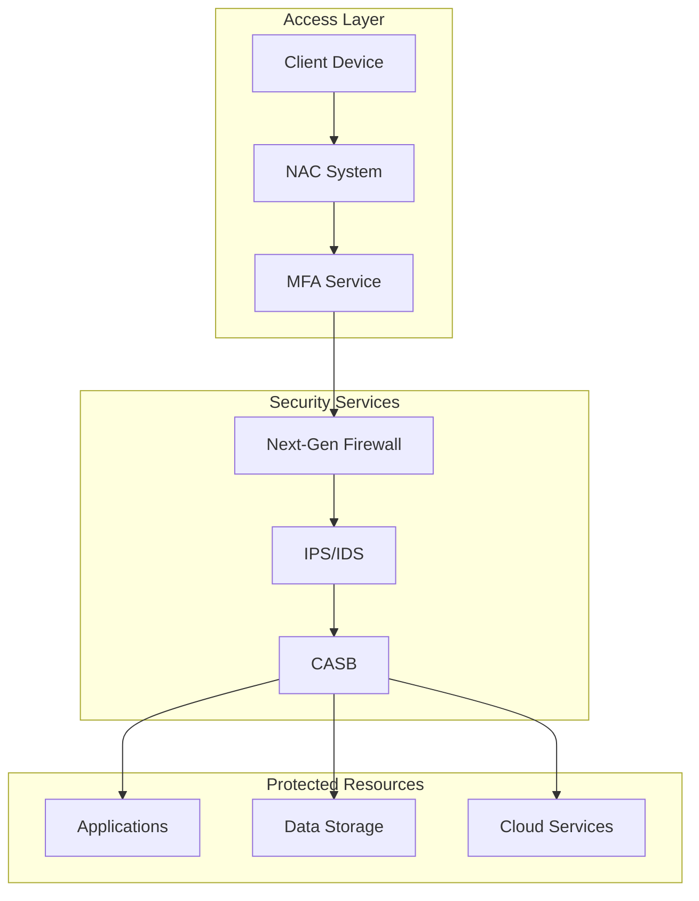

### DMZ Implementation

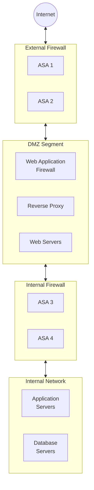

## Advanced Configuration Examples

### EVPN VXLAN Fabric

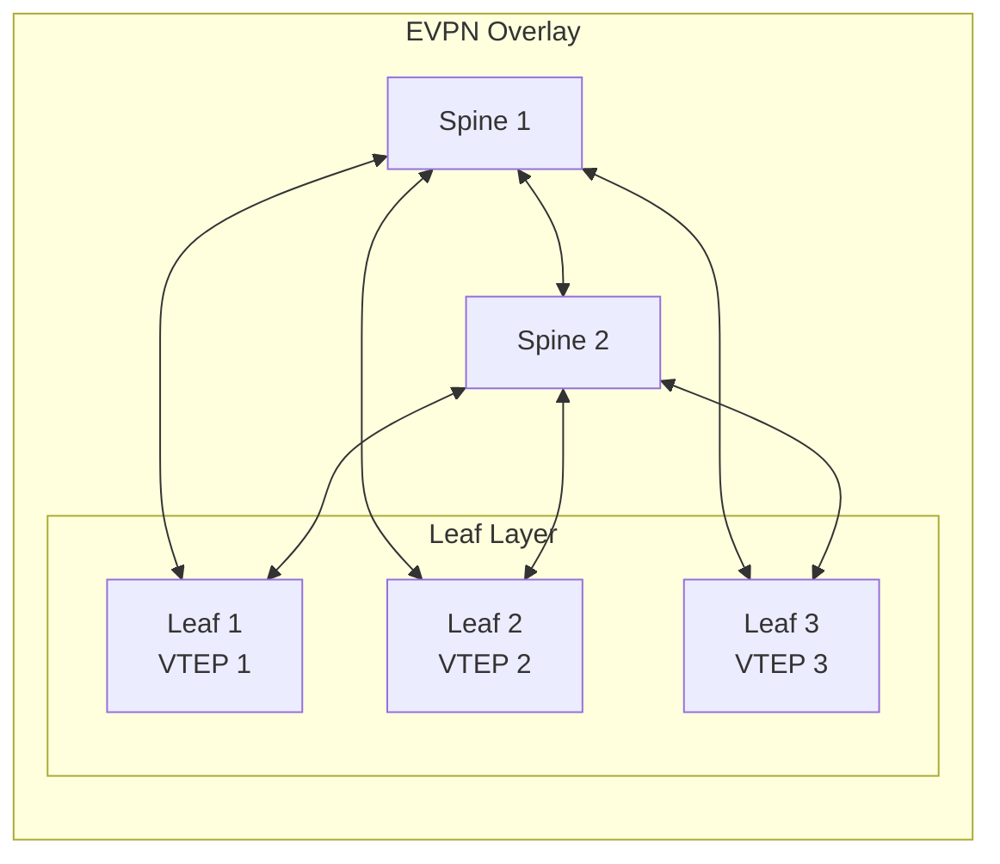
