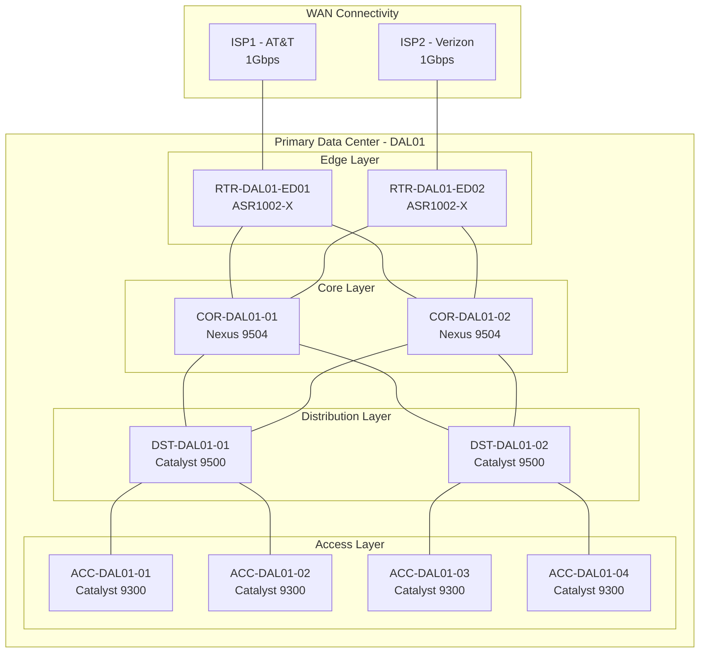
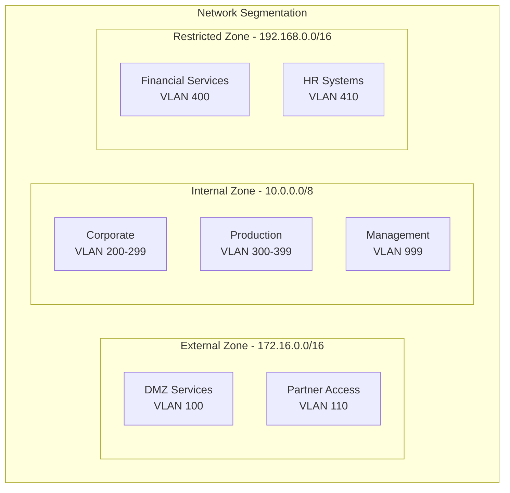
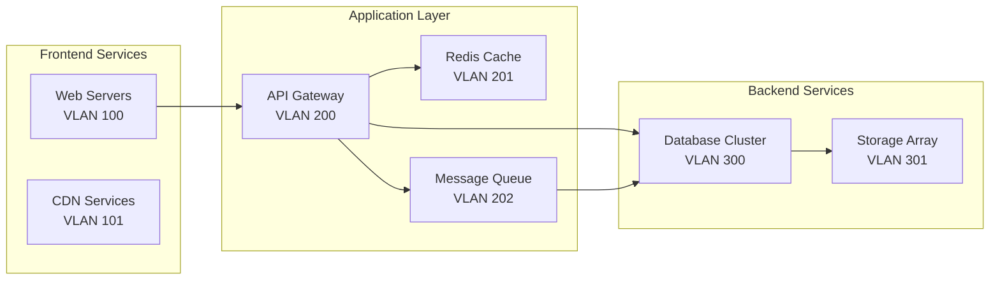
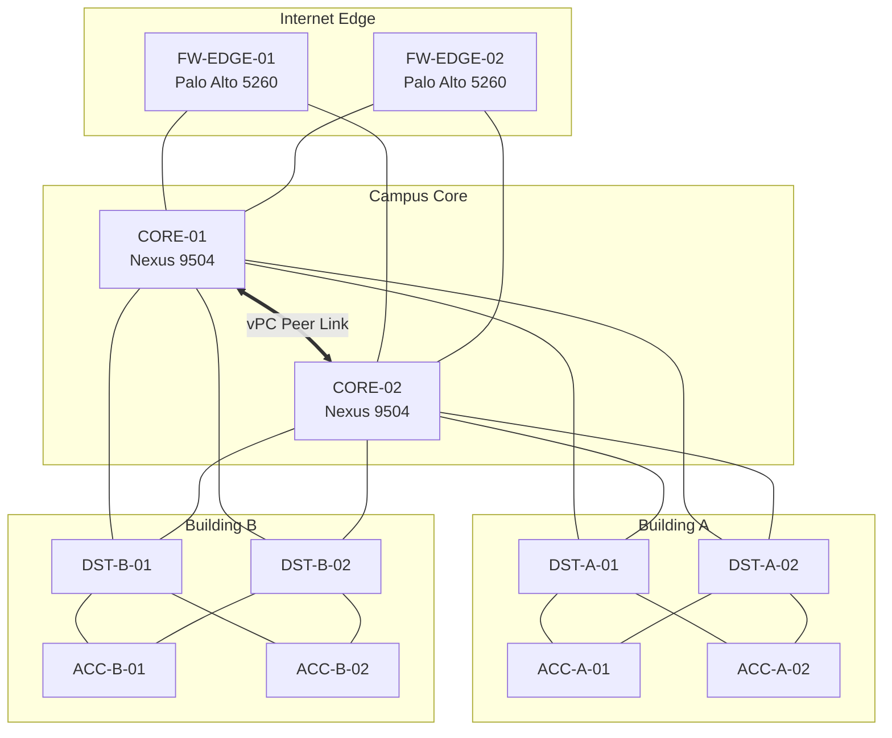
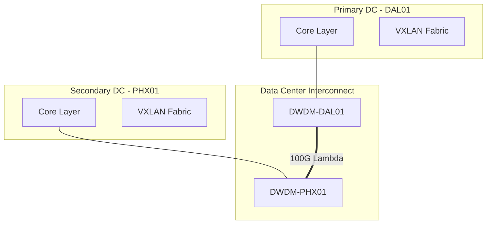
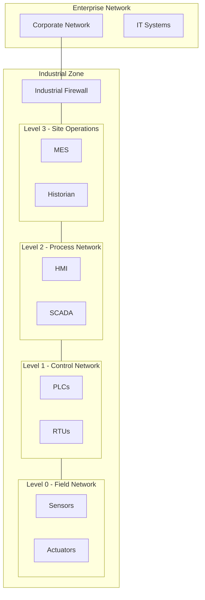
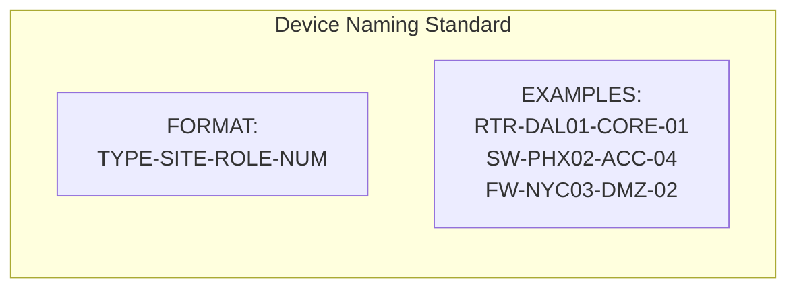
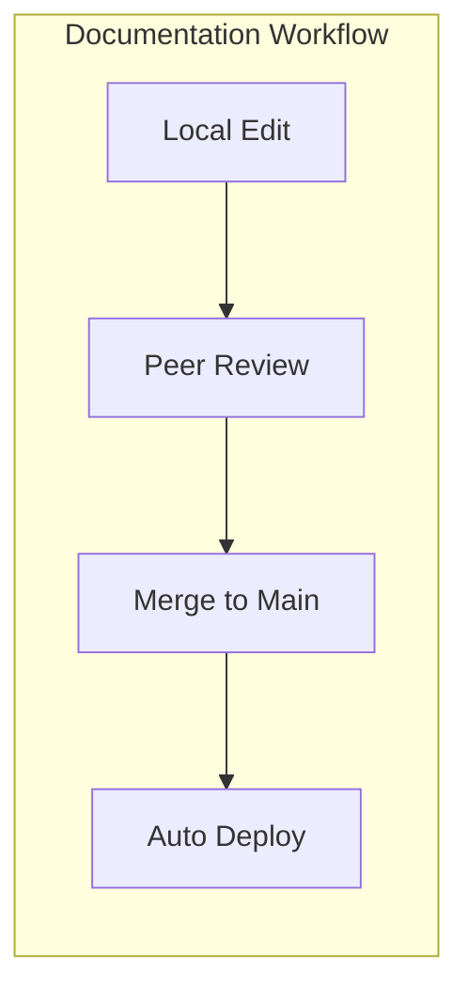

# Network Engineering Documentation with Mermaid - Part 3: Real-World Network Documentation

## Network Documentation Templates

### Physical Network Topology Template



### Logical Network Layout



### Service Dependencies Map



## Case Studies

### Enterprise Campus Network Implementation



### Multi-Site Data Center Connectivity



### Industrial Network Segmentation



## Documentation Standards and Best Practices

### Naming Convention Standards



### Version Control Integration



### Documentation Style Guidelines

1. Diagram Hierarchy
   - L1: Network Overview
   - L2: Site-Specific Details
   - L3: Component Details

2. Color Coding Standards
   ```mermaid
   flowchart LR
       classDef production fill:#e6ffe6,stroke:#006600
       classDef staging fill:#e6f3ff,stroke:#0066cc
       classDef development fill:#ffe6e6,stroke:#cc0000

       P[Production]:::production
       S[Staging]:::staging
       D[Development]:::development
   ```

3. Link Type Representation
   ```mermaid
   flowchart LR
       A[Device A] === B[Device B]
       C[Device C] --- D[Device D]
       E[Device E] -.- F[Device F]

       Note["=== High Speed Link<br/>--- Standard Link<br/>-.- Backup Link"]
   ```

4. Required Documentation Elements
   - Device Information
   - IP Addressing
   - VLAN Assignments
   - Physical Connections
   - Logical Topology
   - Security Zones
   - Change History
