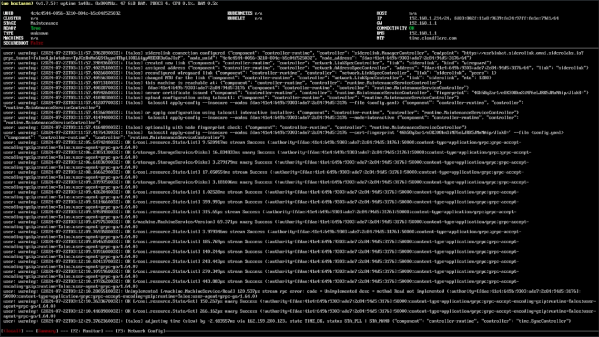

# Kargo Platform Development Pathfinding Journal

## Pathfinding Build Log

> Note: All commands run from the included Github Codespaces Devcontainer environment

### 1. Wipe all block device partitions and partition tables

### 2. Boot Omni Talos on the node(s)

a. Download Talos ISO from Omni Dashboard Image Factory

> Note: URL format follows: `https://${ACCOUNT}.omni.siderolabs.io/omni/?modal=downloadInstallationMedia`


b. Write talos iso to USB device & Boot the node(s) from talos USB

> Note: _I used [balenaEtcher](https://etcher.balena.io) to write the iso to a USB_

c. Boot the node(s) from the talos USB



d. Verify connection to Omni Console > Machines


### 3. Pulumi Login & Prep

1. Pulumi Login

```bash {"id":"01J6MTD7H4YQQQ41E9FH168RV6"}
# Login
pulumi login

# Init Pulumi ESC Emvironment for local config and env
eval $(pulumi env open --format=shell optiplexprime)

# create the organization and project stack
pulumi stack select --create usrbinkat/kargo/optiplexprime

# or select the stack
pulumi stack select usrbinkat/kargo/optiplexprime
```

2. Omni CLI Login

```bash {"id":"01J6MTD7H4YQQQ41E9FMD739CK"}
# Run command to login by following along with the prompts
omnictl get machines
```

3. Kubectl Login

```bash {"id":"01J6MTD7H4YQQQ41E9FP8105X7"}
kubectl get nodes -owide
```

4. Talosctl Login

```bash {"id":"01J6MTD7H4YQQQ41E9FR05PQCT"}
talosctl --nodes $(kubectl get nodes | awk '/talos-/{print $1}' | head -n1) dashboard
```

### 5. Create Cluster Omni Talos Cluster

a. Apply cluster template with omnictl

```bash {"id":"01J6MTD7H4YQQQ41E9FS4Y32HQ"}
# Validate Cluster Template
omnictl cluster template validate -f docs/metal/optiplexprime/cluster.yaml

# Apply Omni CR to create cluster
omnictl cluster template sync -f docs/metal/optiplexprime/cluster.yaml

# Monitor progress
omnictl cluster template status -f docs/metal/optiplexprime/cluster.yaml
```


### 6. Configure Pulumi ESC

* talosconfig
* omniconfig
* kubeconfig
* Download and add the `--skip-open-browser` flag to the kubeconfig oidc-login command arguments

```yaml {"id":"01J6QBPTVAZFXE26XEFYE0X1RF"}
values:
  sidero:
    talosconfig: |
      context: usrbinkat-optiplexprime
      contexts:
          usrbinkat-optiplexprime:
              endpoints:
                  - https://usrbinkat.omni.siderolabs.io
              auth:
                  siderov1:
                      identity: kathryn.morgan@braincraft.io
              cluster: optiplexprime
    omniconfig: |
      context: default
      contexts:
          default:
              url: https://usrbinkat.omni.siderolabs.io
              auth:
                  siderov1:
                      identity: kathryn.morgan@braincraft.io
  kubernetes:
    kubeconfig: |
      apiVersion: v1
      kind: Config
      clusters:
        - cluster:
            server: https://usrbinkat.kubernetes.omni.siderolabs.io
          name: usrbinkat-optiplexprime
      contexts:
        - context:
            cluster: usrbinkat-optiplexprime
            namespace: default
            user: usrbinkat-optiplexprime-kathryn.morgan@braincraft.io
          name: usrbinkat-optiplexprime
      current-context: usrbinkat-optiplexprime
      users:
      - name: usrbinkat-optiplexprime-kathryn.morgan@braincraft.io
        user:
          exec:
            apiVersion: client.authentication.k8s.io/v1beta1
            args:
              - oidc-login
              - get-token
              - --oidc-issuer-url=https://usrbinkat.omni.siderolabs.io/oidc
              - --oidc-client-id=native
              - --oidc-extra-scope=cluster:optiplexprime
              - --skip-open-browser
            command: kubectl
            env: null
            provideClusterInfo: false
  environmentVariables:
    BROWSER: echo
  pulumiConfig:
    kubeconfig: ${kubernetes.kubeconfig}
  files:
    KUBECONFIG: ${kubernetes.kubeconfig}
    OMNICONFIG: ${sidero.omniconfig}
    TALOSCONFIG: ${sidero.talosconfig}
```

```bash {"id":"01J6MTD7H4YQQQ41E9G092KCPQ"}
# Get Pods
kubectl get pods -A
```

### 6. Deploy Kargo Platform

```bash {"id":"01J6MTD7H4YQQQ41E9G12YHVMJ"}
# Create a new Pulumi stack & set kube context
pulumi stack select --create usrbinkat/kargo/optiplexprime

# Explicitly set kube context
pulumi config set --path kubernetes.context usrbinkat-optiplexprime

# Enable Ubuntu VM instance
pulumi config set --path vm.enabled true

# Deploy Kargo Platform (note: repeat command until all resources are healthy)
pulumi up --skip-preview --refresh=true --continue-on-error; pulumi up --skip-preview --refresh=true --continue-on-error; pulumi up --skip-preview --refresh=false
```

### 7. **Deploy a Virtual Machine:**

Deploy an Ubuntu Virtual Machine on the platform using Kubevirt.

> **Note:** Run this step manually via integrated terminal.

```bash {"excludeFromRunAll":"true","id":"01J6MTD7H4YQQQ41E9G20FW0GC","name":"vm"}
# Enable the VM instance
pulumi config set --path vm.enabled true

# Deploy the Kubevirt VM instance
pulumi up --skip-preview --refresh=false
```

### 8. Deploy a tenant talos cluster

```bash {"id":"01J6MTD7H4YQQQ41E9G4KQ6F5E"}
# change to the tenant talos dev directory
cd metal/dev

# Apply the tenant talos
./apply.sh
```

## OptiplexPrime Cluster

3 node optiplex based cluster.


