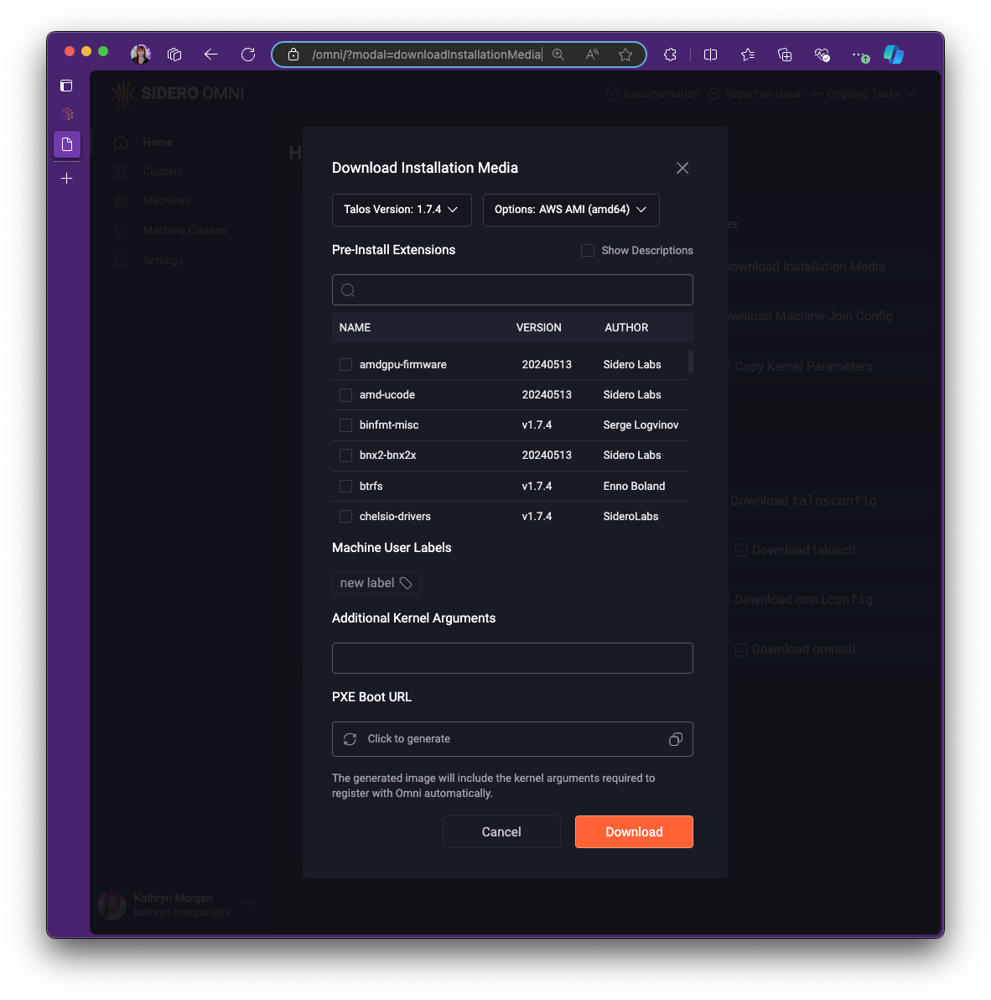
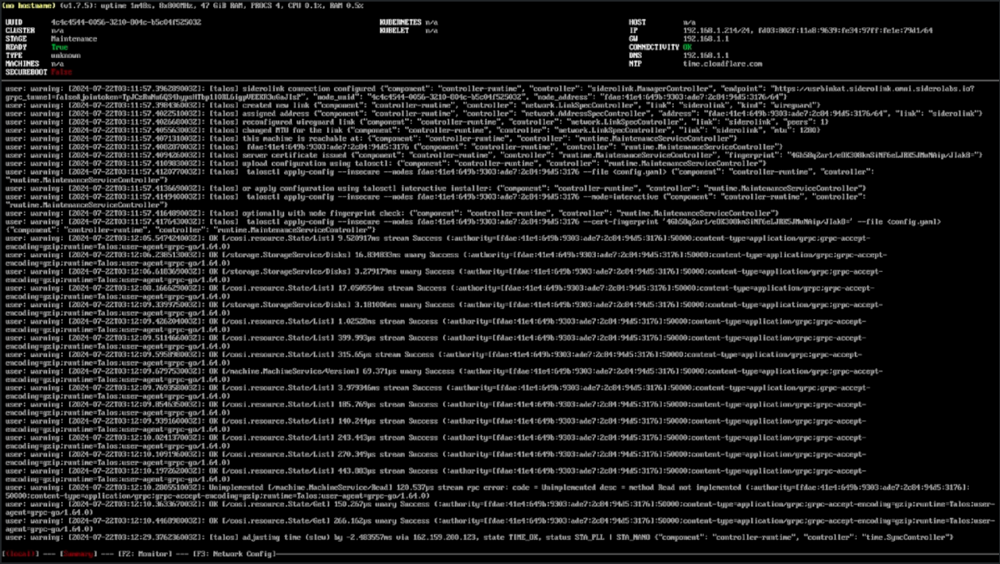
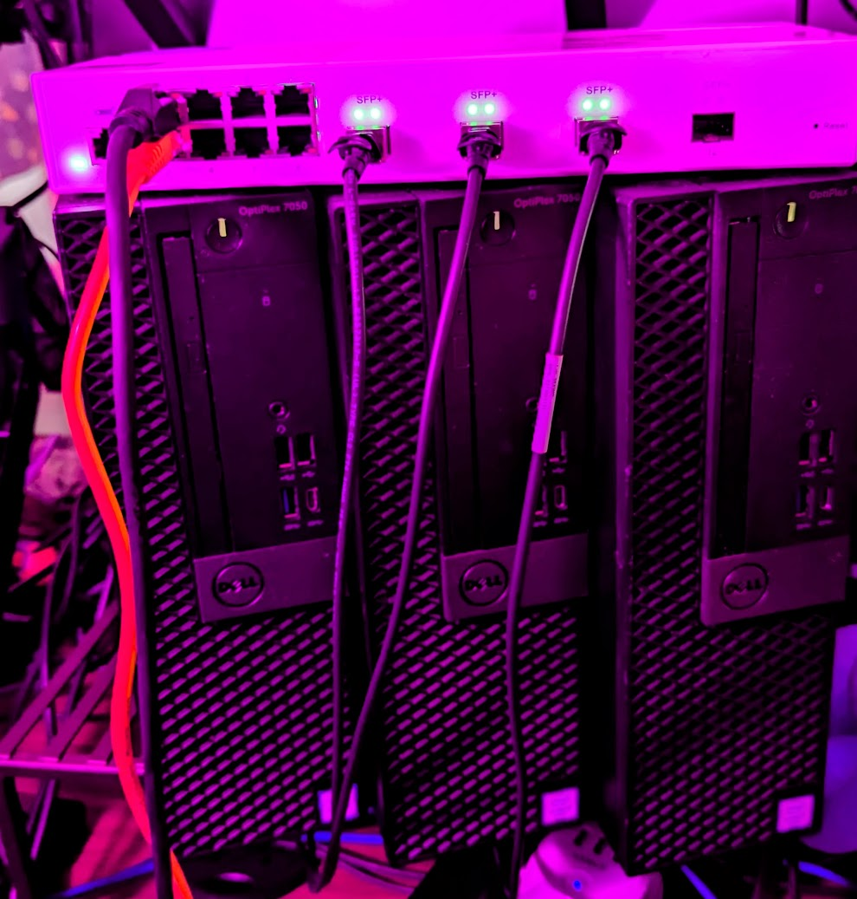

# Kargo Platform Development Pathfinding Journal
## OptiplexPrime

3 node optiplex based cluster.

## Pathfinding Build Log

> Note: All commands are run from the git repository opened in VSCode Konductor Devcontainer
> \*unless otherwise specified

### 1. Wipe all block device partitions and partition tables
### 2. Boot Omni Talos on the node(s)
#### a. Download Talos ISO from Omni Dashboard Image Factory

> Note: URL format follows: `https://${ACCOUNT}.omni.siderolabs.io/omni/?modal=downloadInstallationMedia`



#### b. Write talos iso to USB device & Boot the node(s) from talos USB

> Note: _I used [balenaEtcher](https://etcher.balena.io) to write the iso to a USB_

#### c. Boot the node(s) from the talos USB



#### d. Verify connection to Omni Console > Machines


### 3. Apply Machine Config Patches in Omni Console > Machines > Node > Patches

<details>
<summary>Click to expand Machine Configuration Patch: op1</summary>

```yaml
version: v1alpha1
debug: false
machine:
    kubelet:
        disableManifestsDirectory: true
        extraArgs:
            feature-gates: ServerSideApply=true
        extraMounts:
            - destination: /etc/cni/net.d
              type: bind
              source: /etc/cni/net.d
              options:
                  - bind
                  - rshared
                  - rw
            - destination: /opt/cni/bin
              type: bind
              source: /opt/cni/bin
              options:
                  - bind
                  - rshared
                  - rw
    time:
        disabled: true
    network:
        hostname: op1
        nameservers:
            - 192.168.1.1
        extraHostEntries:
            - ip: 192.168.1.41
              aliases:
                  - op1
        interfaces:
            - interface: br0
              mtu: 1500
              addresses:
                  - 192.168.1.41/24
              routes:
                  - network: 0.0.0.0/0
                    gateway: 192.168.1.1
                    metric: 1024
              bridge:
                  stp:
                      enabled: true
                  interfaces:
                      - enp3s0
    install:
        wipe: true
        extraKernelArgs:
            - talos.platform=metal
            - reboot=k
```
</details>

<details>
<summary>Click to expand Machine Configuration Patch: op2</summary>

```yaml
version: v1alpha1
debug: false
machine:
    kubelet:
        disableManifestsDirectory: true
        extraArgs:
            feature-gates: ServerSideApply=true
        extraMounts:
            - destination: /etc/cni/net.d
              type: bind
              source: /etc/cni/net.d
              options:
                  - bind
                  - rshared
                  - rw
            - destination: /opt/cni/bin
              type: bind
              source: /opt/cni/bin
              options:
                  - bind
                  - rshared
                  - rw
    time:
        disabled: true
    network:
        hostname: op2
        nameservers:
            - 192.168.1.1
        extraHostEntries:
            - ip: 192.168.1.42
              aliases:
                  - op2
        interfaces:
            - interface: br0
              mtu: 1500
              addresses:
                  - 192.168.1.42/24
              routes:
                  - network: 0.0.0.0/0
                    gateway: 192.168.1.1
                    metric: 1024
              bridge:
                  stp:
                      enabled: true
                  interfaces:
                      - enp3s0
    install:
        wipe: true
        extraKernelArgs:
            - talos.platform=metal
            - reboot=k
```
</details>

<details>
<summary>Click to expand Machine Configuration Patch: op3</summary>

```yaml
version: v1alpha1
debug: false
machine:
    kubelet:
        disableManifestsDirectory: true
        extraArgs:
            feature-gates: ServerSideApply=true
        extraMounts:
            - destination: /etc/cni/net.d
              type: bind
              source: /etc/cni/net.d
              options:
                  - bind
                  - rshared
                  - rw
            - destination: /opt/cni/bin
              type: bind
              source: /opt/cni/bin
              options:
                  - bind
                  - rshared
                  - rw
    time:
        disabled: true
    network:
        hostname: op3
        nameservers:
            - 192.168.1.1
        extraHostEntries:
            - ip: 192.168.1.43
              aliases:
                  - op3
        interfaces:
            - interface: br0
              mtu: 1500
              addresses:
                  - 192.168.1.43/24
              routes:
                  - network: 0.0.0.0/0
                    gateway: 192.168.1.1
                    metric: 1024
              bridge:
                  stp:
                      enabled: true
                  interfaces:
                      - enp3s0
    install:
        wipe: true
        extraKernelArgs:
            - talos.platform=metal
            - reboot=k
```
</details>

### 4. Pulumi Login & Prep

```bash
# Login
pulumi login

# Create a new Pulumi stack & set kube context
pulumi stack select --create kargo
pulumi config set --path kubernetes.context usrbinkat-optiplexprime

# Init Pulumi ESC Emvironment for local config and env
eval (pulumi env open --format=shell kargo)
```

### 5. Omnictl Login & Prep

```bash
# Run command to login by following along with the prompts
omnictl get machines
```

### 6. Create Cluster Omni Talos Cluster

1. Apply cluster template with omnictl

```bash
# Apply Omni CR to create cluster
omnictl cluster template sync -f metal/optiplexprime/omni-cluster.yaml
```

2. Apply Cluster Config Patch in Omni Console > Cluster > Patches

```yaml
cluster:
    allowSchedulingOnControlPlanes: true
    apiServer:
        disablePodSecurityPolicy: true
```

3. Monitor Progress until cluster is ready

```bash
# Monitor progress
omnictl cluster template status -f metal/optiplexprime/omni-cluster.yaml
```

4. Test Kubectl Access

```bash
# Get Pods
kubectl get pods -A
```

### 7. Deploy Kargo Platform

1. Re-run command until all pods are running

```bash
pulumi up --skip-preview --continue-on-error
```

## OptiplexPrime Cluster


