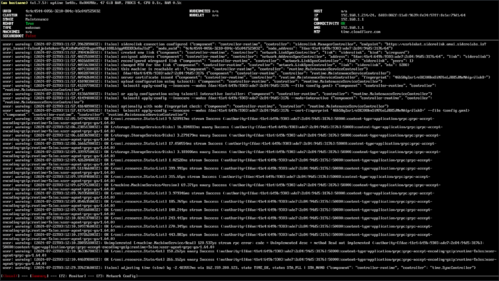
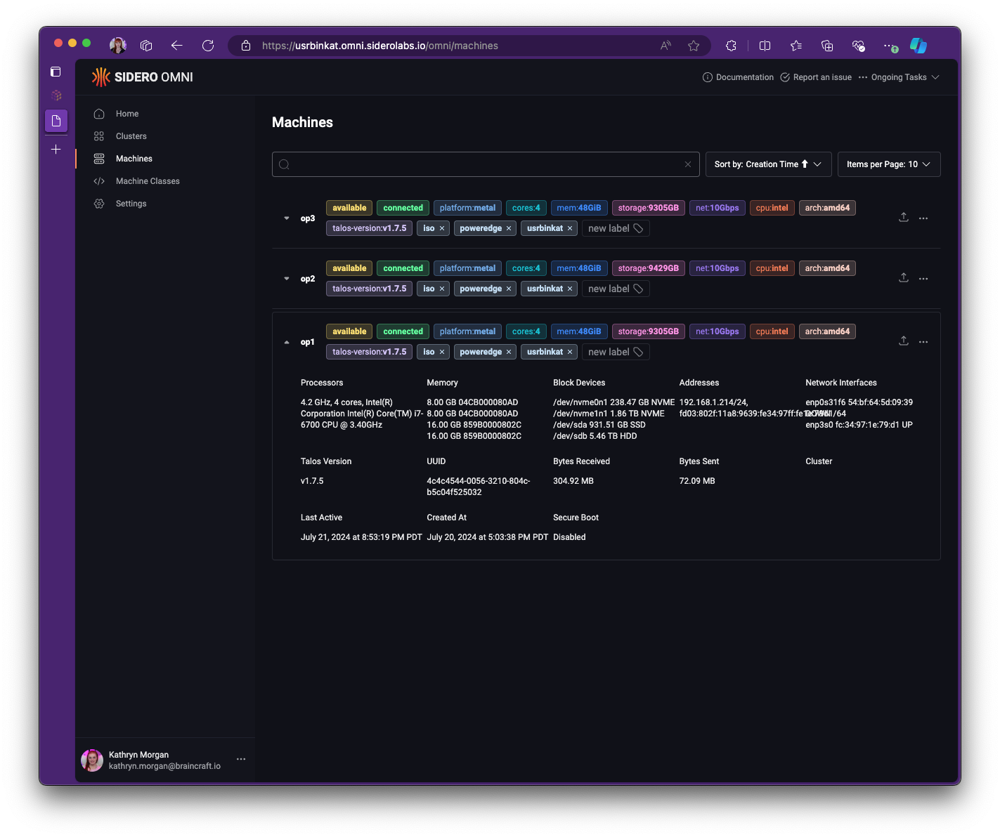
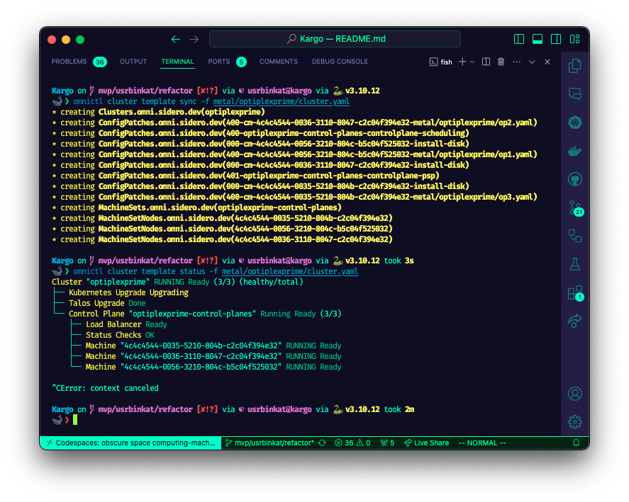

# Kargo Platform Development Pathfinding Journal

## Pathfinding Build Log

> Note: All commands run from the included Github Codespaces Devcontainer environment

### 1. Wipe all block device partitions and partition tables
### 2. Boot Omni Talos on the node(s)

a. Download Talos ISO from Omni Dashboard Image Factory

> Note: URL format follows: `https://${ACCOUNT}.omni.siderolabs.io/omni/?modal=downloadInstallationMedia`


b. Write talos iso to USB device & Boot the node(s) from talos USB

> Note: _I used [balenaEtcher](https://etcher.balena.io) to write the iso to a USB_

c. Boot the node(s) from the talos USB



d. Verify connection to Omni Console > Machines



### 3. Pulumi Login & Prep

```bash
# Login
pulumi login

# Init Pulumi ESC Emvironment for local config and env
eval (pulumi env open --format=shell kargo)
```

### 4. Omnictl Login & Prep

```bash
# Run command to login by following along with the prompts
omnictl get machines
```

### 5. Create Cluster Omni Talos Cluster

a. Apply cluster template with omnictl

```bash
# Validate Cluster Template
omnictl cluster template validate -f metal/optiplexprime/cluster.yaml

# Apply Omni CR to create cluster
omnictl cluster template sync -f metal/optiplexprime/cluster.yaml

# Monitor progress
omnictl cluster template status -f metal/optiplexprime/omni-cluster.yaml
```



2. Test Kubectl Access

```bash
# Get Pods
kubectl get pods -A
```

### 6. Deploy Kargo Platform

```bash
# Create a new Pulumi stack & set kube context
pulumi stack select --create kargo

# Explicitly set kube context
pulumi config set --path kubernetes.context usrbinkat-optiplexprime

# Deploy Kargo Platform (note: repeat command until all resources are healthy)
pulumi up --skip-preview --refresh=true; pulumi up --skip-preview --refresh=true; pulumi up --skip-preview --refresh=true
```

### 7. Deploy an Ubuntu VM

```bash
kubectl apply -f hack/ubuntu-br0.yaml
```

### 8. Deploy a tenant talos cluster

```bash
# change to the tenant talos dev directory
cd metal/dev

# Apply the tenant talos
./apply.sh
```

## OptiplexPrime Cluster

3 node optiplex based cluster.


