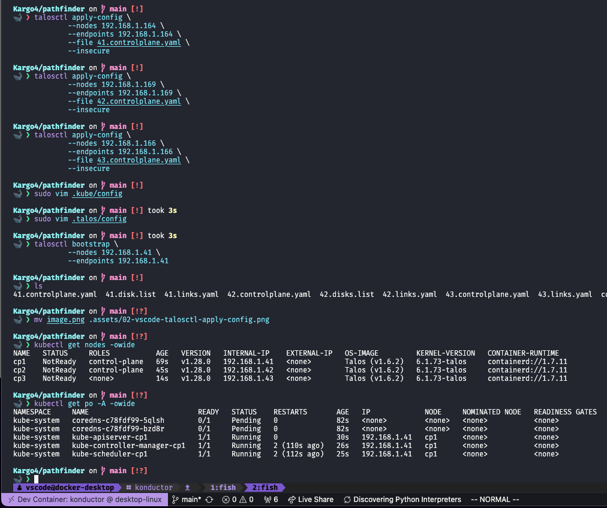

# Kargo Platform Development Pathfinding Journal

> Note: All commands are run from the git repository opened in VSCode Konductor Devcontainer
> *unless otherwise specified

## Pathfinding Build Log

```bash
# konductor devcontainer additional requirements
# consider upstreaming these to the konductor devcontainer
#
# ~$ sudo apt-get install -y inetutils-ping # for ping command > now upstreamed
```

### 0. Write Ubuntu Desktop iso to USB device

1. Boot Ubuntu Desktop
1. Use gparted, gnome disks, wipefs, or sfdisk, or other disk utility to delete all partitions on all host disks

```bash
wipefs --all --force /dev/nvme0n1
sfdisk --delete --wipe always /dev/nvme0n1
```

### 1. Download latest talos iso

> Note: *download this iso to the host machine which you will write USB devices from*

```bash
export VERSION=$(curl -sL https://api.github.com/repos/siderolabs/talos/releases/latest | jq --raw-output .tag_name); echo $VERSION
curl --output ~/Downloads/talos-$VERSION-metal-amd64.iso -sL "https://github.com/siderolabs/talos/releases/download/$VERSION/metal-amd64.iso"
```

### 2. Write talos iso to USB device & Boot the node(s) from talos USB

> Note: *I used balenaEtcher to write the iso to a USB device*


### 3. Generate Talos Cluster Configuration File(s)

> Note: Talos Kubernetes Version Support Matrix Link: https://www.talos.dev/latest/introduction/support-matrix

```bash
# Prepare the local directory
mkdir -p .kube .talos
direnv allow

# Check hardware components
# Find the IP Address of your node on the talos console top right information list

# Query the network links of your node(s) and save the output to a yaml file
talosctl --nodes 192.168.1.164 get links --insecure | tee links.list
talosctl --nodes 192.168.1.166 get links --insecure | tee links.list
talosctl --nodes 192.168.1.169 get links --insecure | tee links.list

# Find the disk configuration of your node(s)
talosctl --nodes 192.168.1.164 disks --insecure | tee disks.list
talosctl --nodes 192.168.1.164 disks --insecure | tee disks.list
talosctl --nodes 192.168.1.164 disks --insecure | tee disks.list

# Generate your talos kubernetes secrets
talosctl gen secrets --talos-version v1.6.2 --output-file secrets.yaml

# Generate the talos machine boilerplate configuration files
# Populate the install disk flag with the block device of your choice following the disks.list from earlier
talosctl gen config kargo "https://api.kube.kargo.io:6443" \
    --additional-sans "192.168.1.40,192.168.1.41,192.168.1.42,192.168.1.43,api.kube.kargo.io" \
    --with-secrets ./secrets.yaml \
    --kubernetes-version "1.28.0" \
    --talos-version "v1.6.2" \
    --install-disk /dev/nvme0n1 \
    --persist \
    --output .
```

### 4. Edit Talos Machine Configuration File(s)

- Validate the talos machine configuration file(s) with the following command
- Resolve any errors before proceeding

```bash
talosctl validate --mode metal --config 41.controlplane.yaml
talosctl validate --mode metal --config 42.controlplane.yaml
talosctl validate --mode metal --config 43.controlplane.yaml
```

> see included pathfinder/41.controlplane.yaml for example

### 5. Apply Talos Cluster Config

```bash
# Apply the cluster configuration to each node
talosctl apply-config \
    --nodes 192.168.1.164 \
    --endpoints 192.168.1.164 \
    --file 41.controlplane.yaml \
    --insecure

talosctl apply-config \
    --nodes 192.168.1.169 \
    --endpoints 192.168.1.169 \
    --file 42.controlplane.yaml \
    --insecure

talosctl apply-config \
    --nodes 192.168.1.166 \
    --endpoints 192.168.1.166 \
    --file 43.controlplane.yaml \
    --insecure

# Bootstrap the first controlplane etcd node
# *be careful to wait for node to cycle through reboot before proceeding to bootstrap command
# *bootstrap may return an error if the node is not ready after the network bridge creation config applies
talosctl bootstrap \
    --nodes 192.168.1.41 \
    --endpoints 192.168.1.41
```

### 6. Load configs in local directory tree for now

```bash
# move talosconfig to .talos/config
mv talosconfig .talos/config

# My talos config generated an endpoint address of 127.0.0.1
# this obviously will not work so let's change that to our VIP
sed -i 's/127.0.0.1/192.168.1.40/g' .talos/config

# Generate kubeconfig ./.kube/config
talosctl --nodes 192.168.1.41 kubeconfig .kube/config --force

# Kubeconfig is generated with FQDN API endpoint by default since I configured it in the machine cfg
# If DNS is not configured to resolved your api endpoint you can use the following command to replace the FQDN with the IP Address
# Use the IP Address of the VIP for your controlplane in place of the DNS name of your endpoint
sed -i 's/api.kube.kargo.io/192.168.1.40/g' .kube/config
```


### 7. Check your cluster status

```bash
# Check the status of your cluster
kubectl get po -A

# check for pending Certificate Signing Requests (CSR)
kubectl get csr

# Approve the pending CSR(s)
kubectl get csr | awk '/Pending/ {print $1}' | xargs -n 1 kubectl certificate approve

# Check the status of your cluster
# All pods should come up except for coredns pods because we still need to deploy the cilium CNI
kubectl get po -A
```



## References

```bash
# Get Talos Disk Usage
talosctl --nodes 192.168.1.41 usage -H 2>/dev/null | grep -v readlink | tee du.list
```

### Apply Config Changes

```bash
# Apply the cluster configuration to each node
talosctl apply-config \
    --nodes 192.168.1.41 \
    --endpoints 192.168.1.41 \
    --file 41.controlplane.yaml

talosctl apply-config \
    --nodes 192.168.1.42 \
    --endpoints 192.168.1.42 \
    --file 42.controlplane.yaml

talosctl apply-config \
    --nodes 192.168.1.43 \
    --endpoints 192.168.1.43 \
    --file 43.controlplane.yaml
```

### Wipe Nodes & Reset

```bash
# If necessary perform an API call to reset the node(s) to a clean state
# CAUTION:
#  - This will destroy all data on the node(s)

talosctl reset --debug \
    --nodes 192.168.1.41 \
    --endpoints 192.168.1.41 \
    --system-labels-to-wipe STATE \
    --system-labels-to-wipe EPHEMERAL \
    --graceful=false \
    --reboot

talosctl reset --debug \
    --nodes 192.168.1.42 \
    --endpoints 192.168.1.42 \
    --system-labels-to-wipe STATE \
    --system-labels-to-wipe EPHEMERAL \
    --graceful=false \
    --reboot

talosctl reset --debug \
    --nodes 192.168.1.43 \
    --endpoints 192.168.1.43 \
    --system-labels-to-wipe STATE \
    --system-labels-to-wipe EPHEMERAL \
    --graceful=false \
    --reboot
```